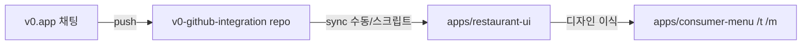

# v0 ↔ CHAYA 디자인 동기화

v0가 푸시하는 저장소: **[Zolababo/v0-github-integration](https://github.com/Zolababo/v0-github-integration)**  
CHAYA 모노레포 안의 참조 앱: **`apps/restaurant-ui`** (README·v0 프로젝트 링크 동일)  
실제 손님/점주 서비스: **`apps/consumer-menu`** (+ 점주 `/m/*`)

## 한 줄 요약

| 단계 | 무엇이 일어나는지 |
|------|-------------------|
| 1 | v0에서 UI 수정 → `v0-github-integration` `main`에 커밋·Vercel 배포 |
| 2 | CHAYA에서 `apps/restaurant-ui`를 그 저장소와 **맞춤**(수동 pull 또는 subtree) |
| 3 | 변경된 컴포넌트를 **매핑 표** 보고 `consumer-menu`에 **스타일만 이식** (로직·RLS·i18n 유지) |
| 4 | `docs/DESIGN_UI_UX_GUIDE_A0.md` 체크리스트 갱신 → 빌드·`npx vercel deploy --prod --yes` |

**완전 자동 병합은 불가에 가깝습니다.** v0 코드는 데모(목 데이터, Sheet 장바구니, 결제 없음)이고 CHAYA는 테넌트·게스트 세션·서버 주문·정책 플래그가 붙어 있기 때문입니다.

## 현재 구조



- `restaurant-ui`는 **디자인 레퍼런스**이지, 프로덕션 배포 대상이 아닙니다(Vercel 프로젝트 루트는 `consumer-menu`).
- 이미 이식한 영역은 `docs/DESIGN_UI_UX_GUIDE_A0.md` 1~6차에 정리되어 있습니다.

## v0 저장소 → `apps/restaurant-ui` 맞추기

### A. 일회성/가끔 (가장 단순)

```bash
# chaya-app 루트에서
git remote add v0-design https://github.com/Zolababo/v0-github-integration.git 2>/dev/null || true
git fetch v0-design main

# restaurant-ui만 v0 main 기준으로 덮어쓰기 (주의: 로컬 수정 있으면 먼저 커밋)
git checkout v0-design/main -- apps/restaurant-ui
# 필요 시 pnpm install (루트) 후 apps/restaurant-ui 빌드 확인
```

### B. 장기 — git subtree (한 repo에 v0 히스토리 유지)

```bash
# 최초 1회 (이미 restaurant-ui 폴더가 있으면 팀과 합의 후 진행)
git subtree add --prefix=apps/restaurant-ui v0-design main --squash

# 이후 v0에 커밋될 때마다
git fetch v0-design main
git subtree pull --prefix=apps/restaurant-ui v0-design main --squash
```

### C. 자동화 (선택) — GitHub Actions

`v0-github-integration`의 `push`/`workflow_dispatch`에서 `chaya-app`으로 PR을 여는 워크플로는 **가능**합니다.  
다만 `apps/restaurant-ui` 전체 교체 PR은 충돌·pnpm lock이 커질 수 있어, **주 1회 또는 v0 태그** 단위를 권장합니다.

## 컴포넌트 매핑 (v0 → CHAYA)

| v0 (`restaurant-ui`) | CHAYA (`consumer-menu`) | 비고 |
|----------------------|-------------------------|------|
| `menu-header.tsx` | `session-header.tsx`, `consumer-header-toolbar.tsx` | CHAYA는 Link·locale·쉬운 모드 |
| `category-tabs.tsx` | `menu-category-chips.tsx` | |
| `menu-list.tsx` | `menu-board.tsx`, `menu-list-row.tsx` | |
| `featured-banner.tsx` | `menu-promo-carousel.tsx` | |
| `bottom-nav.tsx` | `bottom-nav.tsx` | v0: 장바구니 **Sheet** / CHAYA: **`/cart` 라우트** |
| `cart-sheet.tsx` | `cart-checkout-client.tsx`, `cart/page.tsx` | 패턴 다름 — **클래스·간격·수량 버튼만** 참고 |
| `app/globals.css` / theme | `app/globals.css`, `manifest.ts` | `--chaya-primary` 등 |
| (없음) | `guest-orders-hub.tsx`, orders 상세 | v0에 없으면 CHAYA만 유지·a0 톤 적용 |

**방금 v0에서 손댄 장바구니·주문 탭**이면 우선 위 표의 `cart-sheet` / `bottom-nav` diff를 보고, CHAYA의 `bottom-nav.tsx`, `cart-checkout-client.tsx`, `menu-cart-sticky-bar.tsx`, `guest-orders-hub.tsx`에 **Tailwind 클래스·레이아웃만** 반영하면 됩니다.

## 이식 시 체크리스트 (매번)

- [ ] `CONSUMER_CHECKOUT_PAYMENT_UI_VISIBLE` = false — 결제 UI 추가 금지
- [ ] `guest_session`·주문 RPC·미들웨어 **미변경**
- [ ] i18n: 하드코딩 한글은 `consumer-messages` 또는 기존 패턴
- [ ] 터치 44px·큰글씨(`easyMode`) 깨지지 않는지
- [ ] `apps/consumer-menu` 빌드 + 필요 시 프로덕션 배포

## Cursor / 에이전트에게 시키는 문장 예시

> `v0-github-integration`의 최신 `main`을 `apps/restaurant-ui`에 맞춘 뒤, `cart-sheet`·`bottom-nav` 변경만 diff로 보고 `consumer-menu`의 장바구니·하단 탭·주문 목록에 a0 톤을 이식해줘. 로직·API는 건드리지 마.

## 관련 문서

- `docs/DESIGN_UI_UX_GUIDE_A0.md` — 이미 반영된 1~6차
- `apps/restaurant-ui/README.md` — v0 프로젝트 직링크
